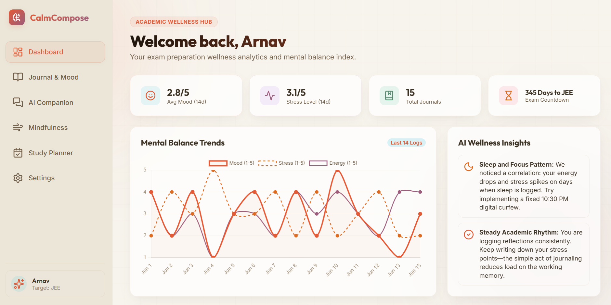

# 🌿 CalmCompose

**AI-Powered Mental Wellness Companion for Students & Exam Aspirants**

CalmCompose is a modern web application designed to help students manage stress, track emotional well-being, build mindfulness habits, and maintain healthy study routines during high-pressure exam preparation.

Built with a warm, distraction-free interface, CalmCompose combines journaling, mood tracking, AI-powered emotional insights, guided mindfulness exercises, and productivity tools into a single wellness dashboard.

🔗 **Live Demo:** https://calm-compose.vercel.app/

---

## ✨ Features

### 📖 Smart Daily Journaling

* Record daily reflections and thoughts
* Track mood, stress, and energy levels
* Tag study-related challenges and emotions
* Generate AI-powered emotional insights

### 🤖 AI Wellness Companion

* Conversational support tailored for students
* Encouraging responses during stressful periods
* Exam-preparation focused guidance
* Quick suggestion prompts for common struggles

### 📊 Mental Wellness Dashboard

* Visualize mood trends over time
* Track stress and energy patterns
* Identify recurring stress triggers
* Monitor emotional progress through charts and analytics

### 🧘 Mindfulness Hub

* Guided breathing exercises
* Multiple breathing techniques
* 5-4-3-2-1 grounding exercise
* Relaxation and focus support tools

### ⏱️ Focus & Study Planner

* Pomodoro study timer
* Fatigue-aware recommendations
* Study session management
* Break reminders and focus tracking

### 🎯 Student Personalization

* Custom exam goals (JEE, NEET, UPSC, Boards, etc.)
* Exam countdown timer
* Personalized wellness suggestions
* Local data storage for privacy

### 🔒 Privacy First

* No account required
* Data stored locally in browser
* User-controlled backups
* Export and restore journal history

---

## 🖼️ Screenshots

### Dashboard



### Journal


### AI Companion


### Mindfulness Hub


> Add screenshots inside a `/screenshots` folder after uploading them.

---

## 🏗️ Tech Stack

### Frontend

* HTML5
* CSS3
* Vanilla JavaScript (ES6+)

### Libraries

* Chart.js
* Lucide Icons

### AI Integration

* Google Gemini API
* Local fallback response engine

### Deployment

* Vercel

---

## 📁 Project Structure

```text
CalmCompose/
│
├── index.html
├── styles.css
├── app.js
├── data.js
├── gemini.js
│
├── components/
│   ├── journal.js
│   ├── dashboard.js
│   ├── companion.js
│   ├── mindfulness.js
│   ├── planner.js
│   └── settings.js
│
└── vercel.json
```

---

## 🚀 Getting Started

### Clone the Repository

```bash
git clone https://github.com/your-username/CalmCompose.git
cd CalmCompose
```

### Run Locally

Since the project uses pure HTML, CSS, and JavaScript, no installation is required.

Simply open:

```text
index.html
```

in any modern browser.

Alternatively:

```bash
python -m http.server 8000
```

Then visit:

```text
http://localhost:8000
```

---

## ☁️ Deployment

### Deploy with Vercel

1. Fork or clone this repository
2. Push to GitHub
3. Log into Vercel
4. Import the GitHub repository
5. Click **Deploy**

Vercel automatically detects the project as a static web application and deploys it instantly.

---

## 🎨 Design Philosophy

CalmCompose follows a **warm and calming design language** specifically crafted for students dealing with exam stress.

Design goals include:

* Reduced cognitive overload
* Minimal distractions
* Comfortable long-session readability
* Emotional warmth through earth-tone colors
* Mobile-friendly experience

---

## 🌟 Key Use Cases

* Exam preparation stress management
* Daily reflection and self-awareness
* Burnout prevention
* Focus improvement
* Mindfulness practice
* Emotional habit tracking

---

## 🔮 Future Enhancements

* User authentication
* Cloud synchronization
* Advanced AI coaching
* Study analytics
* Community wellness features
* Mobile app version
* AI-generated wellness reports

---

## 🤝 Contributing

Contributions, issues, and feature requests are welcome.

Feel free to fork the repository and submit pull requests.

---

## 📄 License

This project is licensed under the MIT License.

---

## 👨‍💻 Author

**Arnav Singh**

Built with the goal of making exam preparation healthier, more mindful, and less overwhelming for students.
